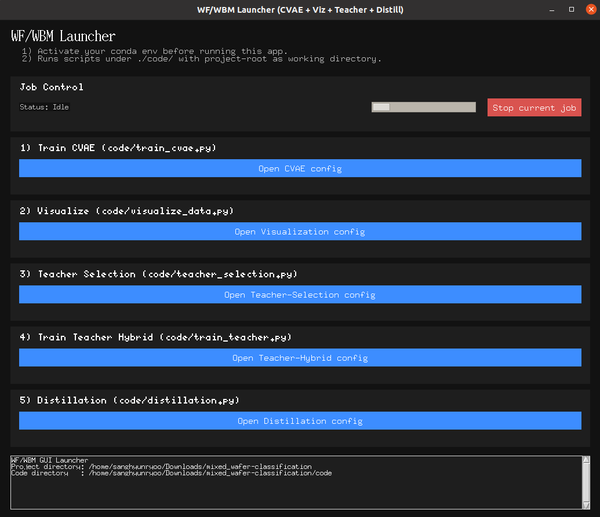
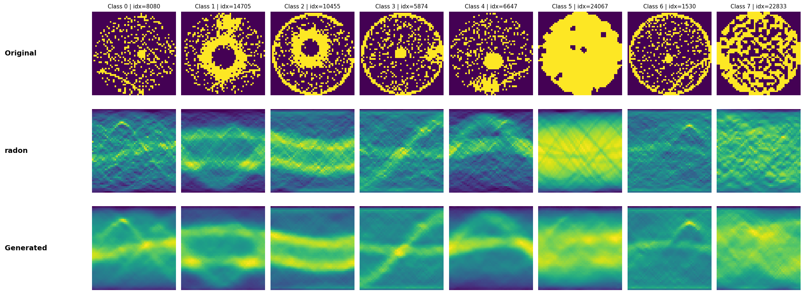

# WBM Framework (CVAE + Hybrid Teacher + Distillation)

This repo provides a small framework to:
- train a **Conv-VAE (CVAE)** for denoising,
- train a **hybrid teacher** using **[original, denoised]** concatenated inputs (2-channel),
- train a **student** via **knowledge distillation** from the teacher,
- and **visualize** *Original / Radon / Generated* samples.

---

## Screenshots

> Put the two images below into an `assets/` folder so they render in this README.

### 1) Main GUI


### 2) Visualization Example



---

## Project Layout

```text
wf_cls/
├── launch.py                      # GUI launcher (project root)
├── code/
│   ├── train_cvae.py              # CVAE training (difficulty-aware)
│   ├── visualize_data.py          # Original/Radon/Generated visualization (difficulty-aware CVAE path)
│   ├── teacher_selection.py       # Base (1ch) teacher candidate training/eval
│   ├── train_teacher.py           # Hybrid (2ch) teacher training/eval (CVAE denoise + concat)
│   └── distillation.py            # Teacher → Student distillation (seed-suffix teacher rule)
├── data/
│   └── {difficulty}/{task}/{data_type}/...    # .npy data
├── weight/
│   ├── cvae/{difficulty}/best.h5              # CVAE weights (weights-only file)
│   ├── pretrained/levit384_imagenet.h5        # LeViT pretrained (optional)
│   └── {model}/{task}/{data_type}/...         # teacher/student weights
└── result/
    └── {task}/{data_type}/{model}/...         # metric csv logs
```

---

## Environment Setup

### 1) Create & activate env (example)
```bash
conda create -n wf_cls python=3.9 -y
conda activate wf_cls
pip install -r requirements.txt
```


---

## Data Convention (Important)

All scripts expect this naming scheme:

```text
data/{difficulty}/{task}/{data_type}/{task}_{split}_data.npy
data/{difficulty}/{task}/label/{task}_{split}_label.npy
```

- `difficulty`: e.g. `data_easy`, `data_hard`, `data_extreme`
- `task`: e.g. `mixed`, `multi`, `single`
- `data_type`: e.g. `radon`, `orig`
- `split`: `train`, `val`, `test`

---

## Run with the GUI (Recommended)

From the project root:
```bash
python launch.py
```

The GUI runs scripts located in `code/`.

---


---

## Outputs & Logs

### Weights
- CVAE: `weight/cvae/{difficulty}/best.h5`
- Base teacher candidates: `weight/{model}/{task}/{data_type}/best_{seed}.weights.h5`
- Hybrid teacher: `weight/{model}/{task}/{data_type}/best_{seed}_hybrid.h5`
- Distilled student: `weight/{model}/{task}/{data_type}/best_{seed}_distill.h5`

### Metrics CSV
Saved to:
```text
result/{task}/{data_type}/{model}/
```

---

## Troubleshooting

### `ModuleNotFoundError: keras_cv_attention_models`
Run from the project root:
```bash
python code/train_teacher.py ...
```
Or use the GUI (`python launch.py`).

### `FileNotFoundError: pretrained/levit384_imagenet.h5`
Place the file here:
```text
weight/pretrained/levit384_imagenet.h5
```

### CVAE weights path mismatch
Either:
- place weights at `weight/cvae/{difficulty}/best.h5`, or
- pass `--cvae_path /full/or/relative/path/to/best.h5`

---
