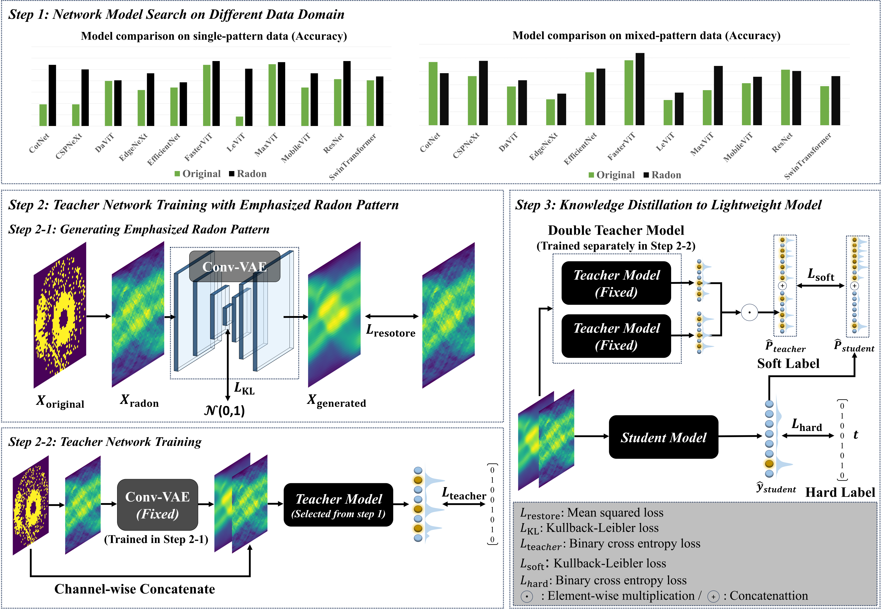

# WBM Framework

This repo provides a small framework to:
- train a **Conv-VAE** for denoising,
- train a **hybrid teacher** using **[original, denoised]** concatenated inputs (2-channel),
- train a **student** via **knowledge distillation** from the teacher,
- and **visualize** *Original / Radon / Generated* samples.

---


### 1) Main GUI


### 2) Visualization Example


---

## Project Layout

```text
wf_cls/
├── launch.py                      # GUI launcher (project root)
├── code/
│   ├── train_cvae.py              # CVAE training 
│   ├── visualize_data.py          # Original/Radon/Generated visualization (difficulty-aware CVAE path)
│   ├── teacher_selection.py       # Base teacher candidate training/eval
│   ├── train_teacher.py           # (CVAE denoise + concat) teacher training/eval
│   └── distillation.py            # Teacher → Student distillation
├── data/
│   └── {difficulty}/{task}/{data_type}/...   
├── weight/
│   ├── cvae/{difficulty}/best.h5              # CVAE weights 
│   ├── pretrained/levit384_imagenet.h5        # LeViT pretrained (optional)
│   └── {model}/{task}/{data_type}/...         # teacher/student weights
└── result/
    └── {task}/{data_type}/{model}/...         # metric csv logs
```

---

## Environment Setup

### 1) Create & activate env (example)
```bash
conda create -n wf_cls python=3.9 -y
conda activate wf_cls
pip install -r requirements.txt
```

---

## Run with the GUI

From the project root:
```bash
python launch.py
```

The GUI runs scripts located in `code/`.


---

## Outputs & Logs

### Weights
- CVAE: `weight/cvae/{difficulty}/best.h5`
- Base teacher candidates: `weight/{model}/{task}/{data_type}/best_{seed}.weights.h5`
- Hybrid teacher: `weight/{model}/{task}/{data_type}/best_{seed}_hybrid.h5`
- Distilled student: `weight/{model}/{task}/{data_type}/best_{seed}_distill.h5`

### Metrics CSV
Saved to:
```text
result/{task}/{data_type}/{model}/
```

---

### We also provide docker image
Can be downloaded:
```text
docker pull jaykor97/wf_cls
```

---